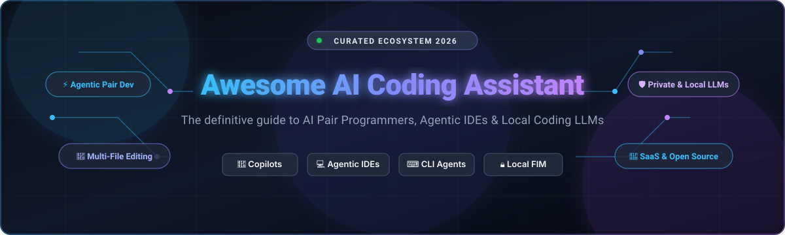

# 🤖 Awesome AI Coding Assistant

<p align="center">
  
</p>

<p align="center">
  <a href="https://github.com/ishandutta2007/Awesome-Awesome-Awesome"></a><a href="https://discord.gg/jc4xtF58Ve"></a>
  <a href="https://github.com/ishandutta2007/Awesome-AI-Coding-Assistant/stargazers"></a>
  <a href="https://github.com/ishandutta2007/Awesome-AI-Coding-Assistant/network/members"></a>
  <a href="https://github.com/ishandutta2007/Awesome-AI-Coding-Assistant/pulls"></a>
  <a href="https://github.com/ishandutta2007/Awesome-AI-Coding-Assistant/blob/main/LICENSE"></a>
  <a href="https://github.com/ishandutta2007"></a>
</p>

---

## 🌟 Ecosystem Overview

> **A curated showcase of top SaaS platforms and open-source GitHub projects for AI pair programming, agentic code generation, autonomous software engineering, inline autocomplete (FIM), and private/local coding LLMs.**

*Keywords: AI Coding Assistant, AI Pair Programming, Copilot Alternatives, Agentic IDE, Code Autocomplete, Fill-In-The-Middle, Terminal Coding Agents, Local LLM Coding, VS Code AI Extensions, Devin Alternatives, Claude 3.5 Sonnet, DeepSeek Coder, Ollama.*

---

## 📑 Table of Contents

- [📊 Market Dynamics & Landscape](#-market-dynamics--landscape)
- [☁️ SaaS & Hosted Platforms](#️-saas--hosted-platforms)
- [🐙 Open-Source GitHub Projects](#-open-source-github-projects)
- [🛠️ Key Architectural Paradigms](#️-key-architectural-paradigms)
- [🤝 How to Contribute](#-how-to-contribute)
- [📈 Star History](#-star-history)
- [📄 Disclaimer](#-disclaimer)

---

## 📊 Market Dynamics & Landscape

> 💡 **Market Size & Structure**: The global AI coding assistant market is estimated at **$5.5B+ in 2026** and projected to exceed **$28B+ by 2030** (~31% CAGR). The ecosystem currently exhibits **moderate fragmentation with rapid top-tier consolidation**—hyperscale tech giants (Microsoft/GitHub, Amazon AWS) and frontier AI-native IDE unicorns (Cognition/Windsurf, Cursor) dominate developer mindshare in a winner-takes-most dynamic, while agile open-source agents (OpenHands, Cline, Aider) and specialized privacy/air-gapped vendors (Tabnine) capture enterprise security and local-first workflows.

---

## ☁️ SaaS & Hosted Platforms

The table below is sorted in descending order by parent company size (market capitalization / valuation):

| Platform | Parent Company & Size | Description & Key Focus | Starting Pricing | Free Tier / Trial Limits |
| :--- | :--- | :--- | :--- | :--- |
| **[GitHub Copilot](https://github.com/features/copilot)** | **Microsoft / GitHub**<br>📊 `~$3.2T+` Market Cap | Industry-standard AI pair programmer integrated across VS Code, JetBrains, Visual Studio, and Neovim. | **$10/month**<br>($100/yr for Copilot Pro) | **Free Plan**: 2,000 code completions/mo and 50 chat/agent requests/mo (auto-model selection). |
| **[Amazon Q Developer](https://aws.amazon.com/q/developer/)** | **Amazon.com / AWS**<br>📊 `~$2.3T+` Market Cap | AWS-optimized AI coding assistant for inline completions, multi-file chat, security vulnerability scanning, and Java/cloud migrations. | **$19/user/month**<br>(Pro Tier) | **Free Tier**: 50 agentic requests/mo, 1,000 lines of Java transformation/mo, and core IDE completions. |
| **[Codeium / Windsurf](https://codeium.com/)** | **Cognition AI**<br>📊 `~$10.0B+` Valuation | Agentic AI IDE featuring the Cascade agent, multi-file awareness, and fast inline autocomplete. | **$20/month**<br>(Pro Tier) | **Free Plan**: Unlimited Tab autocomplete & inline edits; light daily and weekly Cascade agent usage quotas. |
| **[JetBrains AI Assistant](https://www.jetbrains.com/ai/)** | **JetBrains**<br>📊 `~$7.0B+` Valuation | Deeply integrated AI pair programming built directly into the JetBrains IDE suite (IntelliJ, PyCharm, WebStorm, etc.). | **$10/month**<br>($100/yr for AI Pro) | **30-Day Free Trial**: Full AI Pro access; **AI Free plan**: Unlimited local code completion + 3 cloud AI credits per 30 days. |
| **[Replit AI](https://replit.com/)** | **Replit**<br>📊 `~$3.0B+` Valuation | Cloud-native collaborative IDE featuring an autonomous software builder (Replit Agent) to deploy full-stack apps in the browser. | **$20/month**<br>(Core Plan, includes $20/mo AI credits) | **Starter Plan**: Free daily resetting Agent credits, basic AI completion, and 1 published app. |
| **[Sourcegraph Cody](https://sourcegraph.com/cody)** | **Sourcegraph**<br>📊 `~$2.6B+` Valuation | Enterprise AI coding assistant powered by deep semantic code search and comprehensive codebase indexing. | **$19/user/month**<br>(Enterprise Starter) | **30-Day Free Trial**: Full enterprise trial with code graph search and context-aware chat (individual free tier retired). |
| **[Cursor](https://cursor.com/)** | **Anysphere**<br>📊 `~$2.5B+` Valuation | AI-first fork of VS Code engineered for agentic multi-file refactoring, terminal execution, and codebase context retrieval. | **$20/month**<br>(Pro Plan) / ₹649/mo (Start) | **Hobby Plan**: 14-day Pro trial (unlimited features), followed by 2,000 Tab completions/mo & limited agent requests. |
| **[Continue (Cloud/Hub)](https://www.continue.dev/)** | **Anysphere / Continue**<br>📊 `~$2.5B+` Parent Valuation | Commercial hub, team governance, and centralized configuration for organizational coding assistant deployments. | **$10/developer/month**<br>(Team / Hub Plan) | **Free Forever**: Open-source core with unlimited local model/BYO-API usage; **14-Day Free Trial** for Team/Hub features. |
| **[Tabnine](https://www.tabnine.com/)** | **Tabnine Ltd.**<br>📊 `~$150M+` Valuation | Privacy-first AI code assistant offering isolated VPC, air-gapped, and on-premises deployments for regulated enterprise security. | **$39/user/month**<br>(Code Assistant, billed annually) | **90-Day Free Trial**: Full access to Code Assistant features, chat, and context engine during the 90 days (no permanent free tier). |

---

## 🐙 Open-Source GitHub Projects

The list below is sorted in descending order by GitHub Star count:

1. ### 🚀 **[OpenHands (formerly OpenDevin)](https://github.com/All-Hands-AI/OpenHands)** [](https://github.com/All-Hands-AI/OpenHands/stargazers)
   - Autonomous open-source AI software engineer capable of writing code, running bash commands, browsing documentation, and resolving GitHub issues autonomously.

2. ### ⚡ **[Cline](https://github.com/cline/cline)** [](https://github.com/cline/cline/stargazers)
   - Autonomous coding agent extension inside VS Code that inspects file trees, edits code across repositories, executes terminal tasks, and interfaces with Model Context Protocol (MCP) servers.

3. ### 🪿 **[Goose](https://github.com/block/goose)** [](https://github.com/block/goose/stargazers)
   - Open-source, extensible on-machine AI developer agent created by Block that automates complex engineering workflows, tool execution, and local file operations.

4. ### 🧙 **[Aider](https://github.com/Aider-AI/aider)** [](https://github.com/Aider-AI/aider/stargazers)
   - Terminal-native AI pair programming tool with deep git integration, automatic incremental commits, codebase mapping, and multi-file editing support.

5. ### ⏩ **[Continue](https://github.com/continuedev/continue)** [](https://github.com/continuedev/continue/stargazers)
   - Open-source modular AI coding assistant for VS Code and JetBrains — bring any LLM (local via Ollama/vLLM or remote APIs), custom context providers, and prompt slash commands.

6. ### 🐱 **[Tabby](https://github.com/TabbyML/tabby)** [](https://github.com/TabbyML/tabby/stargazers)
   - Self-hosted AI coding assistant server designed for enterprise teams wanting self-hosted Fill-In-The-Middle (FIM) code completions and chat without cloud telemetry.

7. ### 🧑‍✈️ **[GPT-Pilot (Pythagora)](https://github.com/Pythagora-io/gpt-pilot)** [](https://github.com/Pythagora-io/gpt-pilot/stargazers)
   - True AI pair programmer that collaborates with developers to build full-scale web and backend applications step-by-step with real-time feedback loops.

8. ### 🌌 **[Void](https://github.com/voideditor/void)** [](https://github.com/voideditor/void/stargazers)
   - Open-source Cursor alternative code editor that keeps developers in complete control of their AI provider configuration, model routing, and custom tools.

9. ### 🦘 **[Roo Code (Roo-Cline)](https://github.com/RooVetGit/Roo-Code)** [](https://github.com/RooVetGit/Roo-Code/stargazers)
   - Community-driven autonomous coding assistant fork featuring specialized persona modes (Architect, Code, Ask), customized system prompts, and diff-based code updates.

10. ### 🍯 **[Melty](https://github.com/meltylabs/melty)** [](https://github.com/meltylabs/melty/stargazers)
    - Open-source AI editor that watches your workflow from compiler errors to git commits, orchestrating multi-step architectural changes.

---

## 🛠️ Key Architectural Paradigms

```
┌────────────────────────────────────────────────────────────────────────────────────────┐
│                                AI Coding Assistant Stack                               │
├──────────────────────────┬──────────────────────────┬──────────────────────────────────┤
│    🖥️ IDE-Integrated     │    ⌨️ CLI & Terminal     │       🔒 Local / Self-Hosted     │
│   (In-Editor Copilots)   │    (Autonomous Agents)   │        (Private AI Stacks)       │
├──────────────────────────┼──────────────────────────┼──────────────────────────────────┤
│ • GitHub Copilot         │ • Aider                  │ • Tabby ML Server                │
│ • Cursor (Anysphere)     │ • OpenHands (OpenDevin)  │ • Ollama + Continue Extension    │
│ • Windsurf (Cognition)   │ • Goose (Block)          │ • vLLM + DeepSeek Coder          │
│ • JetBrains AI Assistant │ • Cline / Roo Code       │ • Local llama.cpp FIM            │
└──────────────────────────┴──────────────────────────┴──────────────────────────────────┘
```

- **In-Editor Inline Autocomplete (FIM)**: Fast token-streaming completion right at the cursor using Fill-in-the-Middle context formats.
- **Agentic Multi-File Refactoring**: LLMs equipped with file-reading, search, and diff-patching tools that plan and execute multi-step changes across repositories.
- **Model Context Protocol (MCP)**: Standardized protocol allowing coding agents to securely connect to external tools, databases, linters, and APIs.
- **Air-Gapped & Local Inference**: Complete privacy where no code ever leaves the local machine or enterprise VPC, powered by modern quantized open weights (e.g. DeepSeek-Coder, Qwen-2.5-Coder, CodeLlama).

---

## 🤝 How to Contribute

Contributions are welcome! To propose additions or corrections:

1. 🍴 **Fork** this repository.
2. 🌿 Create a new feature branch (`git checkout -b feature/add-new-assistant`).
3. 📝 Add factual descriptions, official links, pricing, and GitHub star counts.
4. 🚀 Open a **Pull Request**.

---

## 📈 Star History

[](https://star-history.dera.page/#ishandutta2007/Awesome-AI-Coding-Assistant&type=date&legend=top-left)

---

## 📄 Disclaimer

*All product names, logos, and brands are property of their respective owners. Mention of commercial products or open-source projects does not imply endorsement.*
